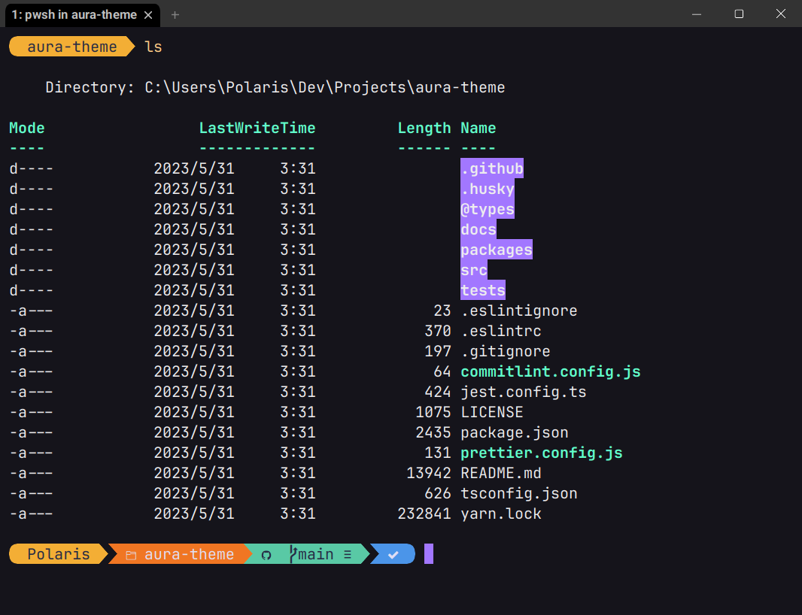

# Aura Dark Theme for WezTerm

Bringing [Aura Theme](https://github.com/daltonmenezes/aura-theme) to WezTerm!

## Screenshot



## Installation

1. Create a directory named `colors` inside your WezTerm configuration directory, typically `$HOME/.config/wezterm`. You can [learn more](https://wezfurlong.org/wezterm/config/appearance.html#defining-a-color-scheme-in-a-separate-file) in WezTerm's documentation.

2. Save `Aura Dark.toml` into the `colors` directory.

3. Add an entry in your config to enable the color scheme:

```lua
config = {
  ...,
  color_scheme = 'Aura Dark'
}

return config
```

WezTerm should automatically reload the config once you save it (the default behavior).

4. Enjoy it!

## License

[MIT © Dalton Menezes](https://github.com/daltonmenezes/aura-theme/blob/main/LICENSE)
